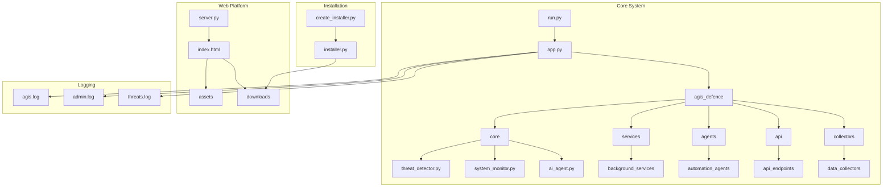
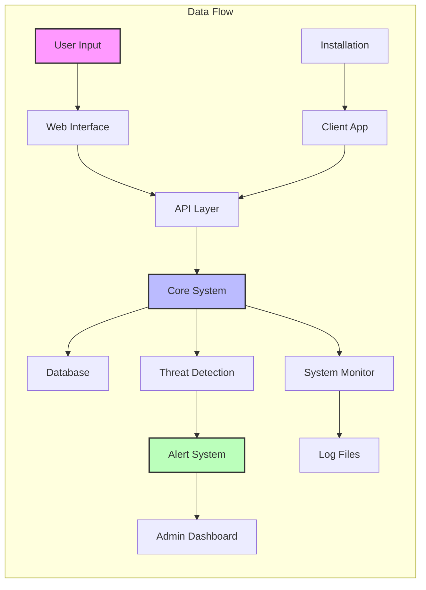
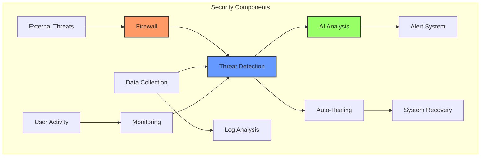

# AGIS Defence System Documentation

## Project Structure Overview

This document provides a comprehensive overview of all files and directories in the AGIS Defence System project.

## System Architecture

### Overall System Structure


### Data Flow Architecture


### Security Architecture


## Component Descriptions

### Core System Components
1. **Initialization Chain**
   - `run.py` → Starts the application
   - `app.py` → Initializes core components
   - `agis_defence/` → Contains main functionality

2. **Security Modules**
   - Threat Detection: Real-time threat analysis
   - System Monitor: Resource and activity monitoring
   - AI Agent: Machine learning-based security

3. **Service Layer**
   - Background Services: Continuous monitoring
   - API Endpoints: External communication
   - Data Collectors: Information gathering

### Web Platform Components
1. **Server Components**
   - `server.py`: Flask-based web server
   - Static Assets: Images, styles, scripts
   - Download Management: Installer distribution

2. **User Interface**
   - Landing Page: Product information
   - Download Section: Platform-specific installers
   - Documentation: User guides

### Installation System
1. **Installer Creation**
   - Package Builder: Creates installers
   - Dependency Management: Handles requirements
   - Platform Support: Windows, Linux, macOS

2. **Distribution**
   - Download Verification: Checksum validation
   - Auto-Update: Version management
   - Installation Logging: Setup tracking

## Root Directory Files

### Core Application Files
- `app.py` - Main application entry point that initializes the AGIS Defence System
- `run.py` - Script to start the application with proper configuration
- `setup.py` - Python package configuration for installation
- `requirements.txt` - List of Python dependencies required by the project

### Configuration and Logging
- `config.py` - Global configuration settings and environment variables
- `agis.log` - Main application log file containing runtime information
- `admin.log` - Administrative actions and system changes log
- `threats.log` - Security threats and incidents log

### Testing
- `test_agis.py` - Unit and integration tests for the AGIS Defence System
- `.pytest_cache/` - Cache directory for pytest test runner

## Core Directories

### 📁 agis_defence/
Main application package containing core defence system components.

- `__init__.py` - Package initialization
- `app.py` - Core application logic
- `core.py` - Essential system functions
- `config.py` - Detailed configuration management
- `alerts.py` - Alert system implementation
- `api.py` - API endpoints and interfaces

Subdirectories:
- `core/` - Core security and monitoring functionality
- `services/` - Background service implementations
- `agents/` - AI and automation agents
- `api/` - API implementations
- `collectors/` - Data collection modules
- `models/` - Data models and database schemas
- `utils/` - Utility functions and helpers
- `healing/` - Self-healing system components
- `firewall/` - Firewall management modules
- `dashboard/` - Admin dashboard components

### 📁 website/
Web-based download platform and documentation.

- `index.html` - Main landing page
- `server.py` - Flask web server for serving content
- `requirements.txt` - Website-specific dependencies
- `README.md` - Website setup instructions

Subdirectories:
- `assets/` - Static assets including logo and images
- `downloads/` - Installation files and packages
- `static/` - Static web content
- `venv/` - Python virtual environment

### 📁 downloads/
Installation and distribution files.

### 📁 installer/
Installation system components.

Files:
- `installer.py` - GUI-based installation system
- `create_installer.py` - Scripts to create installation packages

### 📁 admin_dashboard/
Administrative interface components.

### 📁 client_app/
Client-side application components.

### 📁 data/
Data storage and management.

### 📁 backups/
System backup storage.

## Virtual Environments
- `venv/` - Project-wide Python virtual environment
- `website/venv/` - Website-specific virtual environment

## Additional Resources
- `instance/` - Instance-specific configurations
- `__pycache__/` - Python bytecode cache
- `agis_defence.egg-info/` - Package metadata

## File Dependencies and Connections

### Core System Dependencies
1. Main Application Flow:
   ```
   run.py → app.py → agis_defence/core/ → various modules
   ```

2. Web Platform Flow:
   ```
   website/server.py → website/index.html → assets/ & downloads/
   ```

3. Installation Flow:
   ```
   create_installer.py → installer.py → downloads/
   ```

### Configuration Chain
```
config.py → instance/ → environment variables
```

### Logging Chain
```
app.py → agis.log, admin.log, threats.log
```

## Security Notes
- All sensitive configurations should be stored in `instance/`
- API keys and credentials should never be committed to version control
- Logs contain sensitive information and should be properly secured

## Development Guidelines
1. Always update requirements.txt when adding new dependencies
2. Follow the existing directory structure for new features
3. Add appropriate logging for new functionality
4. Update tests in test_agis.py for new features
5. Document API changes in the appropriate README files

## Deployment Notes
1. The website server (server.py) is for development only
2. Use a production WSGI server for deployment
3. Configure proper security headers and CORS settings
4. Ensure proper file permissions in production

---
Last Updated: June 2025 